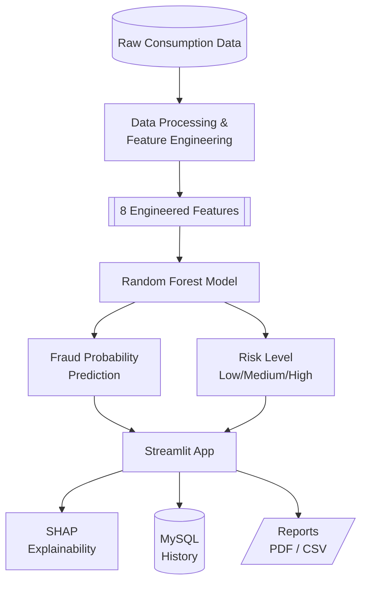
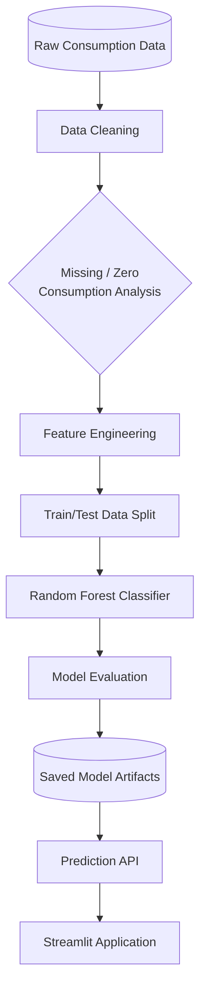
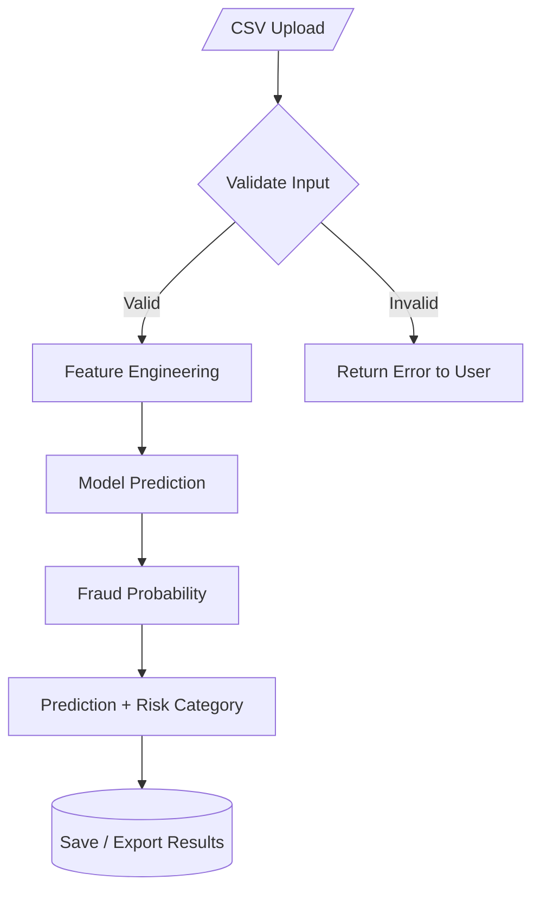
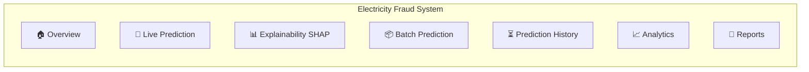

# ⚡ Electricity Fraud Detection System
An enterprise grade, end-to-end machine learning system desighned to electricity theft using smart meter consumption data, autmated ML pipelines, expalinable AI (SHAP)

Live Demo:
GitHub:

---

## 1. Project Overview :
Electricity theft contribute significantly to non-technical loses (NTL) in utility grids. The **Electricity Fraud Detection System** leverages historical usage patterns,anomaly detection, and Random Forest models to flag risk level, generate automated audit reports.

---

## 2. Problem Statement
Traditional utility auditing relies on periodic manual inspections,which are time taking and insufficient.
Key challenges are :
* Inbalance Fruad/Normal classes
* Missing consumption values
* Zero-consumption periods
* Highly variable consumption behaviour
* Need to maintain prediction history for analysis
* Complex Fraud patterns 
* Large-scale consumers consumption data 

---

## 3. Objectives 
* Build an automated electricity consumption data processing pipeline.
* Engineer behavioral features from daily consumptionn data.
* Train a machine learning classifier for fraud risk prediction.
* Handle an imbalanced classification problem.
* Provide interpretable predictions using **SHAP**.
* Support individual and batch predictions.
* Store prediction history in MySQL.
* Generate professional PDF and CSV report

---

## 4. Key Features 
* **Automated Data Processing:** Advanced feature extraction from raw consumptionn dataset.
* **Live Customer Prediction:** Users can provide consumption information and receive fraud probability, prediction and risk level
* **Explainable AI(SHAP):** SHAP is used to make model predictions easier to interpret by showing how important features contribute to the prediction.
* **Batch Ingestion and Scoring:** Upload multi-meter CSV/JSON raw consumtion files.
* **MySQl Storage:** Historical prediction logs.
* **Dashboards and Charts:** Real-time visual metrics, risk distribution, anomaly filters.
* **Reporting:** One-click generation of field inspection PDF and CSV files.

---

## 5. Technology Stack 
|Category|Technologies/Libraries|
|--------|----------------------|
|**Language**|Python 3.9+|
|**Data Processing**|Pandas,Numpy,Scikit-learn|
|**Machine Learning**|Tunned Random Forest|
|**Explainable**|SHAP|
|**Database**|MySQL|
|**Dashboard**|PowerBI,Streamlit|
|**WebApp**|Streamlit|
|**Visualization**|Plotly,Matplotlib,Seaborn|
|**Reporting**|ReportLab|
|**Deployment**|Railway|
|**Version Control**|Git & GitHub|

---

## 6. Sysrem Architecture

---

## 7. Macine Learning Pipeline 

---

## 8. Feature Engineering 
The trained model uses **8 Engineered consumption-behaviour features** :

---
Feature Description
---
|**Feature**|**Description**|
|-------|-----------|
|`std_cons`|Standard deviation of consumption|
|`Stability`|Consumption stability related measure|
|`cv`|Coefficient of Variation|
|`longest_missing_streak`|Longest consecutive missing-consumptionn period|
|`high_cons_ratio`|Ratio of high-consumption behaviour|
|`PAR`|Peak-to-average ration|
|`zero_ratio`|Proportion of zero-consumption observation|

---

## Machine Learning Model
### Algorithm
#### Random Forest Classifier 
Random Forest was selecte because it works well with nonlinear relationships, mixed feature behaviour and complex classification patterns.
#### Model Matrics 
|Metric|score|
|------|-----|
|Accuracy|66.33%|
|ROC AUC|0.746|
|Fraud Recall|70%|
|Fraud Precision|17%|

---

## Explainable AI --- SHAP
The project integrates SHAP(SHapley Addictive exPlanations) to improve model intepretability that ensures :
- Model transparency
- Feature contributions
- investigation workflows 
- identification of important behavioral patterns

---

## Batch Prediction


This makes the application more practical for large-scale screening
instead of limiting it to one customer at a time.

---

## MySQL Integrationn
Prediction history is stored in **MySQL**. that supports operations for :
- Saving predictions
- Search historical predictions
- Filtering by risk
- Filtering by date
- Dashboard Statistics
- Prediction and Risk distribution
- Prediction timeline

---

## Analytics 
Key analytical views include:
- Total prediction records
- Fraud vs normal distribution
- Low/Medium/High risk distribution
- Prediction trends over time
- Historical prediction records

---

## Automated Reporting
The project includes a reporting engine for generating downloadable reports.
#### Executive report
Provide a high-level summary of prediction activity and risk distribution.
#### Batch report
Summarize predictions generated from batch processing.
#### Customer Reports
Provide customer-level prediction information
### Output format :
- **PDF**
- **CSV**

---

## Application Module 

---

## Project Structure 
```
ML_Project/
│
├── data/
│   └── raw/
│   
│
├── models/
│   ├── best_random_forest.pkl
│   ├── feature_names.pkl
│   ├── threshold.pkl
│   ├── shap_explainer.pkl
|   ├── model_comparison.csv
|   └── model_metadata.json
│
├── notebooks/
│   ├── 01_data_understanding.ipynb 
│   ├── 02_data_quality_cleaning.ipynb
│   ├── 03_EDA.ipynb
│   ├── 04_feature_engineering.ipynb
│   ├── 05_feature_selection.ipynb
│   ├── 06_data_preprocessing.ipynb
│   └── 07_model_comparison.ipynb
│
├── src/
│   ├── app.py 
│   ├── app2.py # UI enhanced version
│   ├── predict.py
│   ├── feature_engineering.py
│   ├── database.py
│   ├── report_generator.py
│   ├── pdf_report.py
|   ├── exception.py
|   ├── style.css
|   ├── utils.py
│   └── logger.py
│
├── assets/
│   ├── logo.png
│   └── banner.png
│   
│
├── history/
├── powerBI/
├── reports/
├── requirements.txt
├── .gitignore
└── README.md
```
---

## Local Installation
### 1.Clone the repository
git clone clone https://github.com/vineetvishvakarma1221-rgb/Ml_Project.git
cd ML_Project
### 2.Create a virtual environment
python -m venv .venv
### 3.Ativate the environment
.venv\Scripts\ativate
### 4.Install dependencies
pip install -r requirements.txt
### 5.Configure database
Configure the required MySQL connection variables for your local environment.
### 6.Run the application
python -m streamlit run src/app2.py

---

## Live Demo 
The deployed application is available here:
https://mlproject-production-9a5d.up.railway.app/

---
## Author 
**Vineet Vishvakarma**
---
**B.Tech CSE**|Data Science|Machine Learning 
Interested in :
- Data Science
- Machine leaning
- Explainable AI
- Data Analytics
- Python development
- ML application Development
- Deep Learning
- NLP(Natural Language Processing)

---

## Project Links
Live Demo: 
https://mlproject-production-9a5d.up.railway.app/
GitHub Repository:
https://github.com/vineetvishvakarma1221-rgb/Ml_Project

If you find the project useful, consider giving the repository a ⭐.

---

## Disclaimer
 
This system is designed for risk assessment and investigation support. A model prediction alone should not be treated as definitive evidence of electricity theft. Real-world decisions should involve appropriate technical inspection, utility procedures, and domain validation.